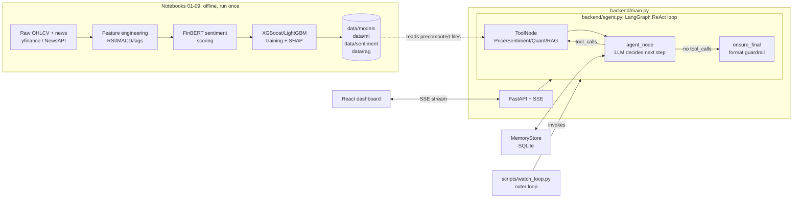

# AI Investment Agent

Production-style LLM-orchestrated investment research agent. A LangGraph
ReAct loop coordinates four tools (technical indicators, FinBERT
sentiment, an XGBoost/LightGBM predictor with SHAP explanations, and a
ChromaDB semantic news search) behind a FastAPI + SSE backend, with a
React dashboard streaming the agent's reasoning in real time.

Built as a 12-week AI/ML engineering internship project. See
[`AI_Investment_Agent_Project_Statement_Final.docx`](./AI_Investment_Agent_Project_Statement_Final.docx)
for the full week-by-week plan.

## Architecture



The LangGraph state machine itself: `agent → (tools → agent)* → final_fix`,
capped at 5 iterations, with LangSmith tracing every transition. See
[`docs/HARNESS_AND_LOOP_ENGINEERING.md`](./docs/HARNESS_AND_LOOP_ENGINEERING.md)
for how the harness (tools/context/observability/eval) and the loop
(inner ReAct loop vs. the outer `watch_loop.py` scheduler) fit together.

## Project structure

```
├── 01_data_collection.ipynb ... 10_agent_orchestration.ipynb   # Week 1-10 pipeline (run once, in order)
├── backend/
│   ├── agent.py            # Tools + LangGraph ReAct agent + MemoryStore
│   └── main.py             # FastAPI app, SSE streaming, auth, endpoints
├── frontend/                # React + Vite dashboard
├── scripts/
│   ├── evaluate_agent.py   # Agent Evaluation Framework (Week 12)
│   └── watch_loop.py       # Autonomous watchlist scanner (Loop Engineering)
├── tests/                   # pytest suite (tools, memory, agent logic, API)
├── data/
│   ├── raw/                 # Local OHLCV cache (PriceTool's first choice before yfinance)
│   ├── ml/                  # X_test/scaler/schema -- what QuantTool actually loads
│   ├── models/               # best_model.pkl + SHAP importance
│   ├── sentiment/            # Precomputed FinBERT scores -- SentimentTool reads this, not live inference
│   └── rag/chroma_db/        # Pre-built vector index for RAGTool
├── docs/
│   └── HARNESS_AND_LOOP_ENGINEERING.md
├── Dockerfile, docker-compose.yml, .dockerignore
├── .github/workflows/ci.yml
├── requirements.txt          # Full dev env (notebooks + backend)
├── requirements-backend.txt  # Lean runtime deps only -- what Docker/CI actually installs
└── requirements-test.txt
```

## Setup

### 1. Clone and create a virtual environment

```bash
git clone <this-repo-url>
cd innovation-ai-internship
python3 -m venv venv
source venv/bin/activate      # Windows: venv\Scripts\activate
```

### 2. Install dependencies

For notebook work + running the backend locally:

```bash
pip install --upgrade pip
pip install -r requirements.txt
```

If you only need to run/test the backend (no notebooks), the lighter
`requirements-backend.txt` is enough and matches what Docker/CI install
-- see the comments in that file for why it's a separate, smaller list.

For running the test suite, also install:

```bash
pip install -r requirements-test.txt
```

### 3. Environment variables

Create a `.env` file in the project root:

```bash
# Required -- backend/agent.py's ChatOpenAI client
OPENAI_API_KEY=your-key-here
OPENAI_BASE_URL=https://api.openai.com/v1   # or your provider's endpoint

# Required for /analyze, /history, /performance auth (x-api-key header)
# Defaults to "innovation-ai-2024" if unset -- override this for anything
# beyond local experimentation.
API_KEY=choose-your-own-key

# Optional -- enables LangSmith tracing (Thought -> Action -> Observation)
LANGCHAIN_TRACING_V2=true
LANGCHAIN_API_KEY=your-langsmith-key
LANGCHAIN_PROJECT=ai-investment-agent
```

`.env` is gitignored -- never commit real keys.

### 4. Run the notebooks (only if regenerating data/models)

Notebooks `01` through `10` reproduce the full pipeline: data
collection -> features -> sentiment -> model training + SHAP ->
backtesting -> agent orchestration setup. Run them in order with
Jupyter/JupyterLab if you need to regenerate anything under `data/`.
If you're just running the existing backend, the precomputed files are
already committed and this step isn't necessary.

## Running the backend

### Locally

```bash
uvicorn backend.main:app --reload --port 8000
```

### With Docker

```bash
docker build -t investment-agent-backend .
docker run -p 8000:8000 --env-file .env \
  -v $(pwd)/data/memory:/app/data/memory \
  investment-agent-backend
```

Or with Compose (also mounts `.env` and the memory volume):

```bash
docker-compose up --build
```

Check it's alive:

```bash
curl http://localhost:8000/health
```

### API endpoints

| Method | Path | Auth | Description |
|---|---|---|---|
| GET | `/` | -- | Basic status |
| GET | `/health` | -- | Health check |
| POST | `/analyze` | `x-api-key` | SSE stream of the agent's reasoning for `{ticker, query}` |
| GET | `/history` | `x-api-key` | Past recommendations from MemoryStore |
| GET | `/performance` | `x-api-key` | Model comparison + backtest results |

## Running the frontend

```bash
cd frontend
npm install
npm run dev
```

Points at the backend's SSE endpoint; set the backend URL/API key
wherever `App.jsx` expects them (see the frontend's own `README.md`).

## Testing

```bash
pytest -v
```

37 tests across `tests/test_tools.py`, `test_memory.py`,
`test_agent_logic.py`, and `test_main.py`. No real API key needed --
every test that would otherwise hit the LLM mocks `llm_with_tools`
directly (see `tests/test_agent_logic.py` for why this has to replace
the whole object rather than patch `.invoke`, given how recent
`langchain-core` implements tool-bound models).

## Agent evaluation

```bash
python scripts/evaluate_agent.py --n 5
```

Scores the live agent (real LLM calls -- costs money) on four
dimensions: core tool-calling accuracy, response latency,
groundedness against QuantTool's own signal, and a hallucination
check. Outputs a CSV, a JSON summary, a chart, and a raw JSON dump of
every full run for manual audit, all under `data/models/eval/`. See
the script's module docstring for exactly how each metric is computed
and why.

## Autonomous watchlist loop

```bash
python scripts/watch_loop.py --once
```

Meant to be triggered by cron / Windows Task Scheduler on a cadence,
not run as a standing process. See
[`docs/HARNESS_AND_LOOP_ENGINEERING.md`](./docs/HARNESS_AND_LOOP_ENGINEERING.md)
for the design rationale (budget caps, no-progress detection, what
counts as alert-worthy).

## CI/CD

`.github/workflows/ci.yml` runs on every push/PR to `main`:
1. **test** -- installs `requirements-backend.txt` + `requirements-test.txt`, runs `pytest`
2. **docker-build** -- builds the image and smoke-tests `/health` in a running container (no registry push, no deploy)

No GitHub Secrets required -- all tests use placeholder credentials and
mock the LLM.

## Known limitations

- RAGTool is called conditionally (see `SYSTEM_PROMPT`'s RAGTOOL RULE
  in `backend/agent.py`), not on every request -- by design, but worth
  being able to explain if asked.
- `SentimentTool` and the notebooks' FinBERT scoring are decoupled:
  the agent reads precomputed scores from
  `data/sentiment/news_with_sentiment.csv` rather than running
  inference live, so sentiment is only as fresh as the last time
  `06_sentiment_analysis.ipynb` was run.
- `scikit-learn` is pinned to an exact version (`==1.8.0`) matching
  what `best_model.pkl` was trained with -- bump both together if you
  retrain.
